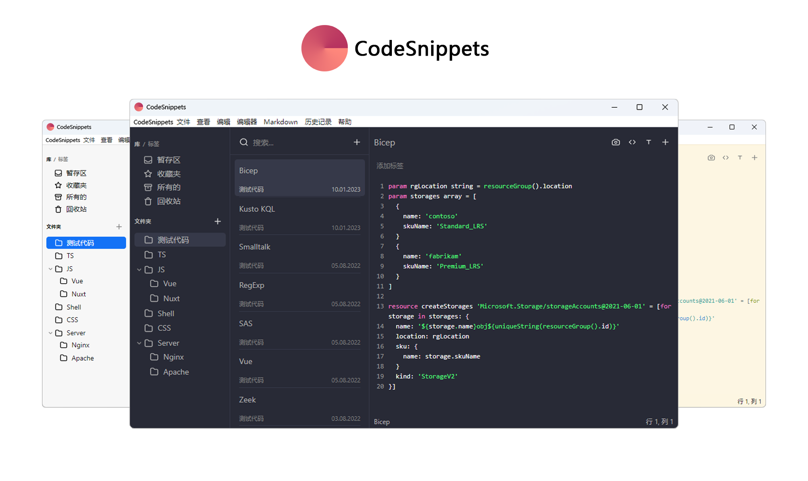

<h1 align="center">CodeSnippets</h1>

  <strong>使用 Electron、Vue 和 Codemirror 构建。</strong>
   
  灵感来自 SnippetsLab、Quiver 和 massCode 等应用程序。

  <a href="https://gitee.com/a101084/CodeSnippets">Gitee 仓库地址</a> |
  <a href="https://github.com/WLongSAMA/CodeSnippets">Github 仓库地址</a>

## 简介

CodeSnippets 是一款面向软件开发人员的代码片段管理工具，它基于另一个名为 [massCode](https://github.com/massCodeIO/massCode) 的开源项目。

## CodeSnippets 与 massCode 的不同之处

1.更加完善的中文语言支持。

2.优化程序配置文件的存放位置。

3.去除没有必要的功能。

4.移除影响使用的捐助提示。

5.修复了一些小问题。

...

不管 CodeSnippets 以后如何改变，唯一不变的是永远开源和免费。

## 特性

### 组织

CodeSnippets 允许你使用多级文件夹和标签来组织代码片段。每个代码片段都支持子片段，这提供了更高级别的组织。

### 编辑器

CodeSnippets 使用 [Codemirror](https://github.com/codemirror/codemirror5) 作为编辑器的基础，`.tmLanguage` 作为代码高亮显示的语法。这种组合最多可以支持 [600](https://github.com/github/linguist/blob/master/vendor/README.md) 种语法高亮方案。该应用程序目前支持 [160](https://github.com/WLongSAMA/CodeSnippets/tree/master/src/renderer/components/editor) 多种编程语言。除了`.tmLanguage`，该应用程序还支持 `.tmTheme` 主题。此外，它还支持 [Prettier](https://prettier.io) 进行代码格式化。

### 实时渲染 HTML 和 CSS

你不仅可以收集代码片段，还可以实时查看 HTML 和 CSS 的渲染结果。测试想法或只是查看结果。

### Markdown

CodeSnippets 支持 Markdown 语法，并提供对语法高亮、表格、列表和其他格式的支持。此外，CodeSnippets 还支持 [Mermaid](https://mermaid-js.github.io/mermaid/#) - 图表绘制工具，可呈现受 Markdown 启发的文本定义以动态创建和修改图表。

### 演示模式

CodeSnippets 允许你从一系列代码片段中制作演示文稿。它非常适合课堂使用、团队会议、会议或只是自己复习笔记。

### 思维导图

CodeSnippets 允许你从 Markdown 创建思维导图，使创建和编辑思维导图的过程快速且直观易懂。这是直观地组织和构建信息的好方法。

### 搜索

无法想象一个不能高效访问特定内容的代码片段管理工具。因此，CodeSnippets 具有快速的全文搜索功能，并突出显示了搜索查询。

### 自动保存

CodeSnippets 会自动保存您在工作期间所做的任何更改，因此您不必担心丢失更改。

### 同步

你可以使用任何提供云同步的服务，例如 iCloud Drive、Google Drive、Dropbox 或其他类似服务。

### 数据库

CodeSnippets 使用简单的 JSON 来存储你的数据。数据库文件位于本地计算机上。

### 集成

CodeSnippets 与 massCode 的扩展相互兼容，支持 [VS Code](https://marketplace.visualstudio.com/items?itemName=AntonReshetov.masscode-assistant)、[Raycast](https://www.raycast.com/antonreshetov/masscode) 和 [Alfred](https://github.com/massCodeIO/assistant-alfred) 扩展，这为使用应用程序提供了更多可能性。使用 VS Code 扩展，你可以获得禅意模式，搜索必要的代码片段并立即插入它们，或将选定的代码片段另存为新的代码片段。

### 漂亮的截图

在不同的背景和不同的模式下创建精美的片段图像

### 开发人员工具

CodeSnippets 为开发人员提供了一系列方便的工具，例如：
-  文本工具：大小写转换器、Slug 生成器、行排序、URL 解析器
-  加密与安全：哈希、HMAC、密码和 UUID 生成器
-  编码和解码：URL、Base64

## 概况

创建这个应用程序的目的主要是我作为开发人员自身的成长。此外，我希望这个项目能够吸收市场上已经存在的此类应用程序（包括免费和付费）中的最佳部分。同时，我希望这个项目是一个开源项目。

## 许可证

[AGPL-3.0](https://github.com/WLongSAMA/CodeSnippets/blob/master/LICENSE)

massCode：Copyright (c) 2019-现在, [Anton Reshetov](https://github.com/antonreshetov).

CodeSnippets：Copyright (c) 2024, [WLong](https://github.com/WLongSAMA/CodeSnippets).
